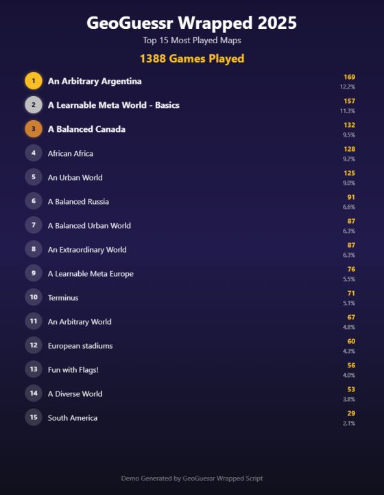

# GeoGuessr Wrapped 2025

A userscript that analyzes your 2025 GeoGuessr activity and generates a beautiful summary of your most played maps.

📸 Click to view example output

## Installation

1. Install [Tampermonkey](https://tampermonkey.net/) browser extension
2. Click here to install: **[GeoGuessr Wrapped](https://raw.githubusercontent.com/lonanche/geoguessr-wrapped/main/geoguessr-wrapped.user.js)**
3. Go to [geoguessr.com/me/activities](https://www.geoguessr.com/me/activities)
4. Click the "Start" button to analyze your 2025 games
5. Click "Generate Image" after analysis is done to get your GeoGuessr 2025 wrapped

## Features

- 📊 **Complete 2025 Analysis** - Automatically fetches all your games from 2025
- 🏆 **Top Maps Ranking** - View your 30 most played maps with play counts and percentages
- 🖼️ **Image Generation** - Create and download a shareable image of your top 20 maps

## How it Works

The script scans your GeoGuessr activity feed, starting from your most recent games and going backwards until it finds games from 2024. It then:

- Counts games played on each map
- Shows total games and unique maps statistics
- Displays a ranked table of your most played maps
- Generates a downloadable PNG image perfect for sharing

The script adds a clean interface to your activities page with:
- Total games and maps statistics
- Interactive table showing your top maps
- Option to view all maps or just top 30
- Generate image button for easy sharing